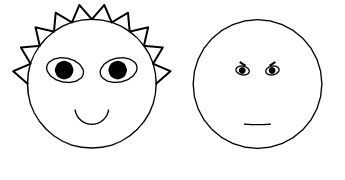

# Chernoff Faces For Process Model Quality

[Chernoff faces](https://en.wikipedia.org/wiki/Chernoff_face) are a whimsical data visualization technique invented by Hermann Chernoff, exploiting the ability of human brains to recognize small differences in facial features easily. 

This simple library uses matplotlib and adapts an earlier version by [Abraham Flaxman](https://gist.github.com/aflaxman/4043086) ([@aflaxman](https://gist.github.com/aflaxman)). As well as the traditional 18 variables, it adds hair. 



I first learned of this technique from the novel _Blindsight_, by Peter Watts, which is excellent, and everyone should go and read. And I should probably also mention some criticisms. A good roundup is by [Robert Kosara](https://eagereyes.org/criticism/chernoff-faces), and Lee et al (see References) found some empirical evidence that interpreting Chernoff Faces can actually be slow and inaccurate. So have a think about that too, if you're actually planning to use these in some serious context.


# Installation

`pip install -r requirements.txt`

(I use a venv)


# Example Use


```
    vec[EYE_SIZE] = precision
    vec[EYEBROW_SLANT] = 1-simplicity
    ax = fig.add_subplot(5,5,1+offset,aspect='equal')
    cface(ax, *vec)
```

See [`pmqfaces.py`](src/pmqfaces.py) for a full working example.


# References

Herman Chernoff, The Use of Faces to Represent Points in K-Dimensional Space Graphically, Journal of the American Statistical Association, vol. 68, no. 342, pp. 361–368, 1973.

Lee, M. D., Reilly, R. E., & Butavicius, M. E. (2003). An empirical evaluation of Chernoff faces, star glyphs, and spatial visualizations for binary data. Proceedings of the Asia-Pacific Symposium on Information Visualisation - Volume 24, 1–10.
